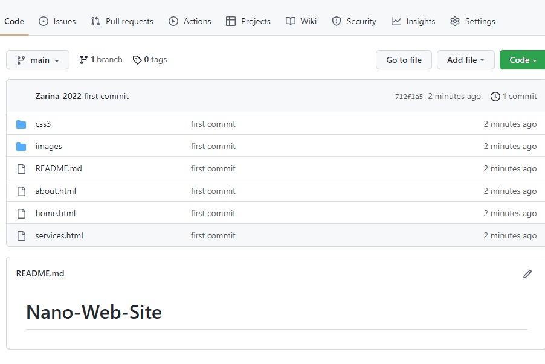

# Nano-Web-Site

<h2>In this project I designed a clean coded responsive mobile friendly HTML5 website for a fictional web design company. I used semantic 

HTML tags like header and footer as well as the basics of HTML and CSS. This is a great project for beginners.</h2>

<h3>The screen view:</h3>

<h2> How to install and run the project. </h2>

Enjoy Coding ❤

